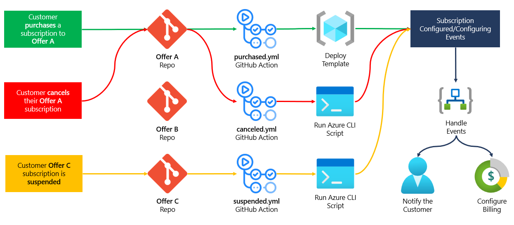

# Edgar
[E]vent-[D]riven [G]itHub [A]ction [R]unner

> 🧪⚠️ __Highly experimental.__ Don't use in production. You've been warned.

## Edgar and SaaS

Edgar is designed primarily to support ISVs that are building SaaS apps on the Microsoft Azure cloud platform.

When building a SaaS app, it's critical to respond to subscription lifecycle events (purchased, suspended, reinstated, canceled, etc.) in as real time as possible so that, typically, ISVs are only paying for Azure resources (and other services) that their customers are paying for. Since most Azure services can be consumed using a "pay as you go" or PAYG pricing model, automating configuration of the underlying infrastructure needed to support SaaS subscriptions helps reduce financial risk and ensure profitability.

## How does Edgar work?

Imagine a simple, single-tenant SaaS app that provisions an [Azure Linux VM](https://azure.microsoft.com/en-us/services/virtual-machines/linux/) for each SaaS subscription.

* When a subscription is purchased, a new VM should be created.
* When a subscription is suspended, the VM should be stopped/deallocated.
  * In this state, the VM still exists but the ISV is no longer paying for its compute.
* When a subscription is canceled, the VM should be deleted altogether.

Using Edgar, and ISV could configure three GitHub actions to support these subscription events.

* `purchased.yml` deploys an ARM template that defines the Linux VM to create.
* `suspended.yml` uses the Azure CLI action to stop/deallocate the VM.
* `canceled.yml` uses the Azure CLI action to delete the VM.
