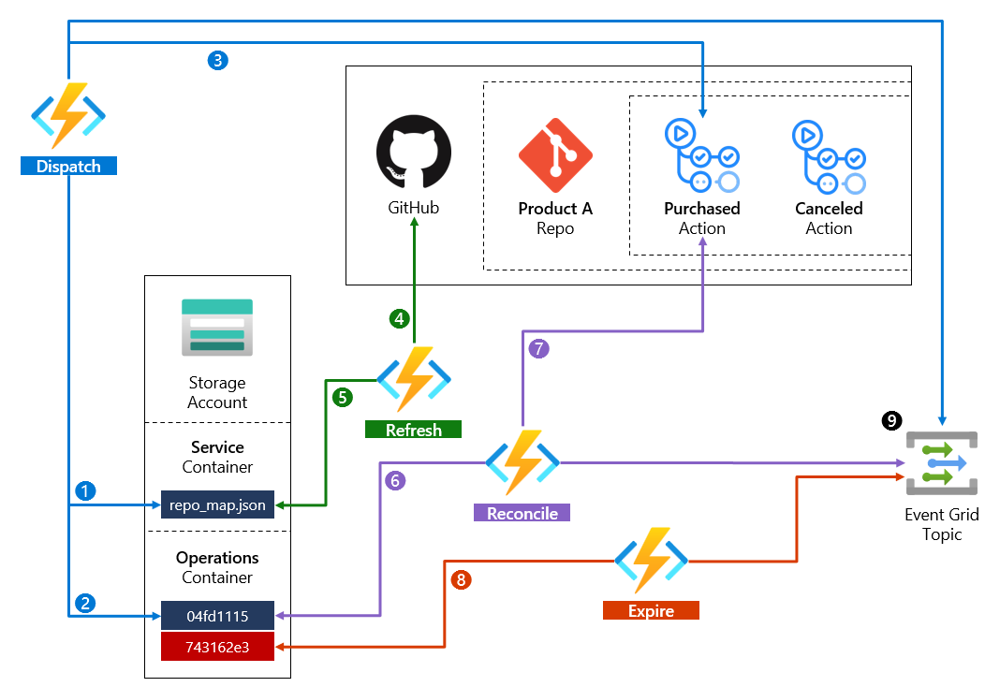

# SaaS Lifecycle Connector for GitHub

🧪⚠️ __Highly experimental.__ Don't use in production.

## Overview

The SaaS Lifecycle Connector for GitHub (SLCG) is an experimental accelerator designed to make it easier for SaaS ISVs to manage the lifecycle of subscription-supported cloud resources — from provisioning to billing events to eventual cancellation — in a lightweight, unopinionated, and very cost-efficient way.

SLCG's design is based on the premise that SaaS ISVs should be spending the bulk of their cloud budget on resources that can be tied directly back to customer subscriptions. Resources are provisioned and scaled just-in-time and deprovisioned automatically when no longer needed. SLCG is self-healing and very cost-effective to run in your own Azure enviroment (typically costing < $10 USD/mo. to operate) highlighting the goal of making SaaS less financially-risky to build while allowing ISVs to make powerful subscription-supported architectural choices that might have been cost-prohibitive in the past.

## How it works

| Function | Notes |
| --- | --- | 
| __Dispatch__ | [The Dispatch function](https://github.com/caseywatson/saas-lifecycle-github/blob/main/Edgar/Dispatch.cs) first [checks the repo map (❶) to see if there is a GitHub repo available to service the request](https://github.com/caseywatson/saas-lifecycle-github/blob/02761146764a98123d35bfb560f33339f9c2de09/Edgar/Dispatch.cs#L73). Then, it [stages the operation blob (❷) for tracking](https://github.com/caseywatson/saas-lifecycle-github/blob/02761146764a98123d35bfb560f33339f9c2de09/Edgar/Dispatch.cs#L130) and [invokes the appropriate GitHub Action (❸)](https://github.com/caseywatson/saas-lifecycle-github/blob/02761146764a98123d35bfb560f33339f9c2de09/Edgar/Dispatch.cs#L138). Finally, [it publishes a “Configuring” event (❾)](https://github.com/caseywatson/saas-lifecycle-github/blob/02761146764a98123d35bfb560f33339f9c2de09/Edgar/Dispatch.cs#L139). |
| __Refresh__ | The Refresh function periodically takes an inventory of all accessible GitHub repos available to handle SaaS lifecycle operations (❹) and, if required, updates the repo map accordingly (❺). |
| __Reconcile__ | The Reconcile function periodically attempts to reconcile outstanding operations (❻) with completed GitHub Action runs (❼). Once reconciled, the applicable operation blob is deleted, and the function publishes either a “Configuration Succeeded [or] Failed” event (❾). |
| __Expire__ | The Expire function provides a self-healing capability that periodically checks for staged operation blobs that are more than 30 days old (❽). For each expired operation, the function deletes the operation blob and publishes a “Configuration Timed Out” event (❾). |

